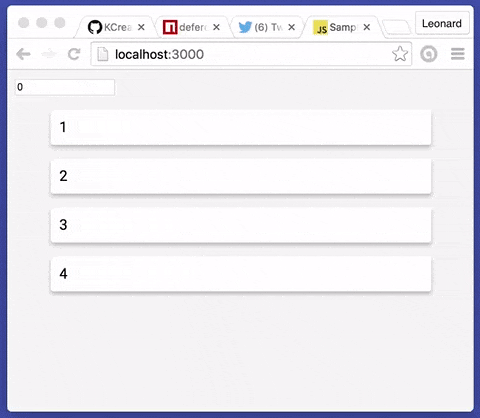

# React: DeferedContainerList

Utility component that allows you to defer the rendering of child components. Useful for transitions between pages that might reuse the same components.

# How do i use it?

Install it (Instructions below) and import the component in your app. Also check out the examples inside the examples folder.

# Installation
```bash
npm install deferedcontainerlist -S
```
Then you can just use it as a regular React component.

# Usage Example

Below is a little app i threw together to demonstrate a possible use case for this library.


# Code Example
[Live Demo](https://jsfiddle.net/fj4zv2tn/15/)
```js
import React form 'react';
import { render } from 'react-dom';
import DeferedContainerList from 'deferedcontainerlist';

render(
    <DeferedContainerList
        delay={150} // miliseconds
        appliedClassName="deferedApplied"
        notAppliedClassName="deferedNotApplied"
        appliedStyle={{ color: 'red' }}
        notAppliedStyle={{ color: 'blue' }}
    >
        {/* Nodes go here */}
    </DeferedContainerList>
);
```

# Important
If your child component has it's own className, this won't work. DeferedContainerList just passes another className prop to your component so you need to add it manually. Something like that:
```javascript
class SomeComponent extends Component {
    render() {
        return (
            <div className={'SomeComponent' + this.props.className}>
                /* ... */
            </div>
        );
    }
}
```

# License
[MIT](https://github.com/KCreate/DeferedContainerList/blob/master/LICENSE)
